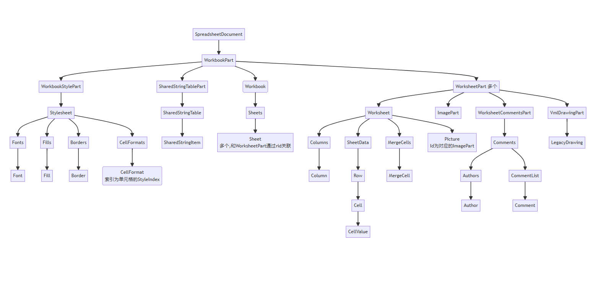

# Spreadsheet - 电子表格操作

提供基于 OpenXML 的电子表格操作功能，支持工作簿、工作表、单元格、样式、批注和图片等操作。



## SpreadsheetHelper

电子表格扩展类，为 OpenXML 的 Workbook、Worksheet、Cell 等对象提供便捷的扩展方法。

## Workbook 扩展方法

### GetWorksheet

根据表名获取工作表。

```csharp
public static Worksheet GetWorksheet(this WorkbookPart workbookPart, string tableName)
```

| 参数 | 类型 | 说明 |
| --- | --- | --- |
| workbookPart | WorkbookPart | 工作簿部件 |
| tableName | string | 表名，如 Sheet1 |

**返回值**: `Worksheet` - 工作表对象

**异常**: 当指定表名不存在时引发异常

##### 示例

```csharp
using var spreadsheet = SpreadsheetDocument.Open("data.xlsx", true);
var workbookPart = spreadsheet.WorkbookPart;
var worksheet = workbookPart.GetWorksheet("Sheet1");
```

---

### GetSharedStringTable

获取或创建共享字符串表。

```csharp
public static SharedStringTable GetSharedStringTable(this WorkbookPart workbookPart)
```

| 参数 | 类型 | 说明 |
| --- | --- | --- |
| workbookPart | WorkbookPart | 工作簿部件 |

**返回值**: `SharedStringTable` - 共享字符串表对象

##### 示例

```csharp
using var spreadsheet = SpreadsheetDocument.Open("data.xlsx", true);
var workbookPart = spreadsheet.WorkbookPart;
var sharedStringTable = workbookPart.GetSharedStringTable();
```

---

### SetSharedStringItem

向共享字符串表中添加字符串。

```csharp
public static int SetSharedStringItem(this SharedStringTable sharedStringTable, string text)
```

| 参数 | 类型 | 说明 |
| --- | --- | --- |
| sharedStringTable | SharedStringTable | 共享字符串表对象 |
| text | string | 要添加的字符串 |

**返回值**: `int` - 共享字符串项的索引，如果字符串已存在则返回现有索引

##### 示例

```csharp
var index = sharedStringTable.SetSharedStringItem("Hello");
Console.WriteLine(index);
// 0
```

## Worksheet 扩展方法

### GetCells

根据条件获取单元格集合。

```csharp
public static IEnumerable<Cell> GetCells(this Worksheet worksheet, Func<Cell, bool> condition)
```

| 参数 | 类型 | 说明 |
| --- | --- | --- |
| worksheet | Worksheet | 工作表对象 |
| condition | Func<Cell, bool> | 筛选条件函数 |

**返回值**: `IEnumerable<Cell>` - 符合条件的单元格集合

##### 示例

```csharp
var cells = worksheet.GetCells(x => x.CellValue is not null);
Console.WriteLine(cells.Count());
```

---

### DeleteRow

删除指定行。

```csharp
public static void DeleteRow(this Worksheet worksheet, uint rowIndex)
```

| 参数 | 类型 | 说明 |
| --- | --- | --- |
| worksheet | Worksheet | 工作表对象 |
| rowIndex | uint | 要删除的行号 |

**异常**: 如果该行有合并单元格，则会产生不可预期的效果

##### 示例

```csharp
worksheet.DeleteRow(5);
```

---

### InsertRow

在指定位置插入空行。

```csharp
public static Row InsertRow(this Worksheet worksheet, uint rowIndex)
```

| 参数 | 类型 | 说明 |
| --- | --- | --- |
| worksheet | Worksheet | 工作表对象 |
| rowIndex | uint | 要插入的行号 |

**返回值**: `Row` - 新插入的空行对象

**异常**: 如果该行有合并单元格，则会产生不可预期的效果

##### 示例

```csharp
var newRow = worksheet.InsertRow(10);
```

---

### InsertColumn

在指定位置插入空白列。

```csharp
public static void InsertColumn(this Worksheet worksheet, string columnName, bool insertColumnCells)
```

| 参数 | 类型 | 说明 |
| --- | --- | --- |
| worksheet | Worksheet | 工作表对象 |
| columnName | string | 列名，如 A、B、C |
| insertColumnCells | bool | 是否为每行插入对应的单元格 |

**异常**: 如果该列有合并单元格，则会产生不可预期的效果

##### 示例

```csharp
// 插入C列，并插入对应的单元格
worksheet.InsertColumn("C", true);

// 仅插入列定义，不插入单元格
worksheet.InsertColumn("D", false);
```

---

### DeleteColumn

删除指定列。

```csharp
public static void DeleteColumn(this Worksheet worksheet, string columnName)
```

| 参数 | 类型 | 说明 |
| --- | --- | --- |
| worksheet | Worksheet | 工作表对象 |
| columnName | string | 要删除的列名，如 A、B、C |

**异常**: 如果该列有合并单元格，则会产生不可预期的效果

##### 示例

```csharp
worksheet.DeleteColumn("C");
```

## Cell 扩展方法

### GetValue

获取单元格的值。

```csharp
public static string? GetValue(this Cell cell, IEnumerable<SharedStringItem> sharedStringItems)
```

| 参数 | 类型 | 说明 |
| --- | --- | --- |
| cell | Cell | 单元格对象 |
| sharedStringItems | IEnumerable<SharedStringItem> | 共享字符串集合 |

**返回值**: `string?` - 单元格的值，如果单元格为空则返回 null

##### 示例

```csharp
var cell = worksheet.CreateCellIfNotExist("A1");
var sharedStringItems = workbookPart.GetPartsOfType<SharedStringTablePart>()
    .FirstOrDefault()?.SharedStringTable?.Elements<SharedStringItem>().ToList() ?? [];
var value = cell.GetValue(sharedStringItems);
Console.WriteLine(value);
```

---

### SetValue

根据值的类型设置单元格值。

```csharp
public static void SetValue(this Cell cell, object? value, SharedStringTable? sharedStringTable)
```

| 参数 | 类型 | 说明 |
| --- | --- | --- |
| cell | Cell | 单元格对象 |
| value | object? | 要设置的值 |
| sharedStringTable | SharedStringTable? | 共享字符串表，可为 null |

##### 示例

```csharp
var cell = worksheet.CreateCellIfNotExist("A1");
var sharedStringTable = workbookPart.GetSharedStringTable();

// 设置字符串
cell.SetValue("Hello", sharedStringTable);

// 设置数字
cell.SetValue(123, sharedStringTable);

// 设置布尔值
cell.SetValue(true, sharedStringTable);
```

---

### CreateCellIfNotExist

如果单元格不存在则创建该单元格。

```csharp
public static Cell CreateCellIfNotExist(this Worksheet worksheet, string cellReference)
```

| 参数 | 类型 | 说明 |
| --- | --- | --- |
| worksheet | Worksheet | 工作表对象 |
| cellReference | string | 单元格引用地址 |

**返回值**: `Cell` - 单元格对象

##### 示例

```csharp
var cell = worksheet.CreateCellIfNotExist("A1");
cell.SetValue("Hello", sharedStringTable);
```

---

### MergeCells

合并单元格范围，只保留左上角的单元格，其余单元格删除。

```csharp
public static MergeCell MergeCells(this Worksheet worksheet, string cellReference1, string cellReference2)
```

| 参数 | 类型 | 说明 |
| --- | --- | --- |
| worksheet | Worksheet | 工作表对象 |
| cellReference1 | string | 第一个单元格引用 |
| cellReference2 | string | 第二个单元格引用 |

**返回值**: `MergeCell` - 合并单元格对象

**异常**: 当找不到 WorkbookPart 时引发异常

##### 示例

```csharp
// 合并单元格 A1:B2
var mergeCell = worksheet.MergeCells("A1", "B2");
```

## Style 扩展方法

### AutoColumnWidth (SpreadsheetDocument)

根据单元格内容长度自动调整所有工作表的列宽。

```csharp
public static void AutoColumnWidth(this SpreadsheetDocument doc)
```

| 参数 | 类型 | 说明 |
| --- | --- | --- |
| doc | SpreadsheetDocument | 电子表格文档对象 |

##### 示例

```csharp
using var spreadsheet = SpreadsheetDocument.Open("data.xlsx", true);
spreadsheet.AutoColumnWidth();
spreadsheet.Save();
```

---

### AutoColumnWidth (WorksheetPart)

根据单元格内容长度自动调整列宽。

```csharp
public static void AutoColumnWidth(this WorksheetPart worksheetPart)
```

| 参数 | 类型 | 说明 |
| --- | --- | --- |
| worksheetPart | WorksheetPart | 工作表部件 |

**异常**: 当找不到 WorkbookPart 时引发异常

##### 示例

```csharp
using var spreadsheet = SpreadsheetDocument.Open("data.xlsx", true);
var workbookPart = spreadsheet.WorkbookPart;
var worksheetPart = workbookPart.GetPartsOfType<WorksheetPart>().First();
worksheetPart.AutoColumnWidth();
```

---

### CreateStyle (SpreadSheetCellStyle)

创建单元格样式。

```csharp
public static uint CreateStyle(this WorkbookPart workbookPart, SpreadSheetCellStyle style)
```

| 参数 | 类型 | 说明 |
| --- | --- | --- |
| workbookPart | WorkbookPart | 工作簿部件 |
| style | SpreadSheetCellStyle | 单元格样式对象 |

**返回值**: `uint` - 样式索引

##### 示例

```csharp
var style = new SpreadSheetCellStyle
{
    FontColor = "#FF0000",
    BackgroundColor = "#FFFFFF",
    FontSize = 12,
    Bold = true
};
var styleId = workbookPart.CreateStyle(style);

// 应用样式到单元格
var cell = worksheet.CreateCellIfNotExist("A1");
cell.StyleIndex = styleId;
```

---

### CreateStyle (CellFormat)

创建单元格格式样式。

```csharp
public static uint CreateStyle(this WorkbookPart workbookPart, CellFormat cellFormat)
```

| 参数 | 类型 | 说明 |
| --- | --- | --- |
| workbookPart | WorkbookPart | 工作簿部件 |
| cellFormat | CellFormat | 单元格格式对象 |

**返回值**: `uint` - 样式索引

##### 示例

```csharp
var font = new Font
{
    FontSize = new FontSize { Val = 14 },
    Bold = new Bold { Val = true }
};
var cellFormat = new CellFormat { FontId = 1 };
var styleId = workbookPart.CreateStyle(cellFormat);
```

---

### UseStyle

为合并单元格中的所有单元格应用样式。

```csharp
public static void UseStyle(this MergeCell mergeCell, SpreadSheetCellStyle style)
```

| 参数 | 类型 | 说明 |
| --- | --- | --- |
| mergeCell | MergeCell | 合并单元格对象 |
| style | SpreadSheetCellStyle | 单元格样式对象 |

**异常**: 当找不到 WorkbookPart 时引发异常

##### 示例

```csharp
var mergeCell = worksheet.MergeCells("A1", "B2");
var style = new SpreadSheetCellStyle
{
    FontColor = "#FF0000",
    BackgroundColor = "#FFFF00",
    FontSize = 14,
    Bold = true
};
mergeCell.UseStyle(style);
```

---

### GetCells (MergeCell)

获取合并单元格范围中的所有单元格。

```csharp
public static List<Cell> GetCells(this MergeCell mergeCell)
```

| 参数 | 类型 | 说明 |
| --- | --- | --- |
| mergeCell | MergeCell | 合并单元格对象 |

**返回值**: `List<Cell>` - 合并范围内的单元格列表

**异常**: 当找不到 Worksheet 时引发异常

##### 示例

```csharp
var mergeCell = worksheet.MergeCells("A1", "B2");
var cells = mergeCell.GetCells();
Console.WriteLine(cells.Count);
// 4
```

## Comments 扩展方法

### SetComment

为单元格设置批注。

```csharp
public static void SetComment(this Cell cell, string author, string comment)
```

| 参数 | 类型 | 说明 |
| --- | --- | --- |
| cell | Cell | 单元格对象 |
| author | string | 批注者名称 |
| comment | string | 批注内容 |

**异常**: 当找不到 WorkbookPart 或 WorksheetPart 时引发异常

##### 示例

```csharp
var cell = worksheet.CreateCellIfNotExist("A1");
cell.SetComment("张三", "这是一个重要数据");
```

## Image 扩展方法

### AddBackground

为工作表添加背景图片。

```csharp
public static void AddBackground(this WorksheetPart worksheetPart, Stream background, string contentType = "image/png")
```

| 参数 | 类型 | 默认值 | 说明 |
| --- | --- | --- | --- |
| worksheetPart | WorksheetPart | - | 工作表部件 |
| background | Stream | - | 背景图片文件流 |
| contentType | string | image/png | 内容类型 |

##### 示例

```csharp
using var spreadsheet = SpreadsheetDocument.Open("data.xlsx", true);
var workbookPart = spreadsheet.WorkbookPart;
var worksheetPart = workbookPart.GetPartsOfType<WorksheetPart>().First();
using var imageStream = File.OpenRead("background.png");
worksheetPart.AddBackground(imageStream);
```

---

### RemoveBackground

删除工作表的背景图片。

```csharp
public static void RemoveBackground(this WorksheetPart worksheetPart)
```

| 参数 | 类型 | 说明 |
| --- | --- | --- |
| worksheetPart | WorksheetPart | 工作表部件 |

##### 示例

```csharp
using var spreadsheet = SpreadsheetDocument.Open("data.xlsx", true);
var workbookPart = spreadsheet.WorkbookPart;
var worksheetPart = workbookPart.GetPartsOfType<WorksheetPart>().First();
worksheetPart.RemoveBackground();
```

## 完整示例

### 创建和操作电子表格

```csharp
using var spreadsheet = SpreadsheetDocument.Create("output.xlsx", SpreadsheetDocumentType.Workbook);
var workbookPart = spreadsheet.AddWorkbookPart();
var workbook = workbookPart.Workbook = new Workbook();

// 添加工作表
var worksheetPart = workbookPart.AddNewPart<WorksheetPart>();
var worksheet = worksheetPart.Worksheet = new Worksheet(new SheetData());
var sheets = workbook.AppendChild(new Sheets());
var sheet = new Sheet { Id = workbookPart.GetIdOfPart(worksheetPart), SheetId = 1, Name = "Sheet1" };
sheets.AppendChild(sheet);

// 获取共享字符串表
var sharedStringTable = workbookPart.GetSharedStringTable();

// 创建单元格并设置值
var cell = worksheet.CreateCellIfNotExist("A1");
cell.SetValue("Hello", sharedStringTable);

cell = worksheet.CreateCellIfNotExist("B1");
cell.SetValue(123, sharedStringTable);

cell = worksheet.CreateCellIfNotExist("C1");
cell.SetValue(true, sharedStringTable);

// 合并单元格
var mergeCell = worksheet.MergeCells("D1", "E1");
var style = new SpreadSheetCellStyle
{
    FontColor = "#FF0000",
    BackgroundColor = "#FFFF00",
    FontSize = 14,
    Bold = true
};
mergeCell.UseStyle(style);

// 添加批注
cell = worksheet.CreateCellIfNotExist("A2");
cell.SetComment("管理员", "这是一个重要单元格");

// 自动调整列宽
worksheetPart.AutoColumnWidth();

// 添加背景图片
using var imageStream = File.OpenRead("background.png");
worksheetPart.AddBackground(imageStream);

spreadsheet.Save();
```

### 读取和修改现有电子表格

```csharp
using var spreadsheet = SpreadsheetDocument.Open("data.xlsx", true);
var workbookPart = spreadsheet.WorkbookPart;
var worksheet = workbookPart.GetWorksheet("Sheet1");
var sharedStringTable = workbookPart.GetSharedStringTable();

// 获取单元格值
var sharedStringItems = workbookPart.GetPartsOfType<SharedStringTablePart>()
    .FirstOrDefault()?.SharedStringTable?.Elements<SharedStringItem>().ToList() ?? [];
var cell = worksheet.Descendants<Cell>().FirstOrDefault(x => x.CellReference == "A1");
if (cell is not null)
{
    var value = cell.GetValue(sharedStringItems);
    Console.WriteLine($"A1的值: {value}");
}

// 修改单元格值
cell = worksheet.CreateCellIfNotExist("B1");
cell.SetValue("新值", sharedStringTable);

// 插入行
worksheet.InsertRow(5);

// 删除行
worksheet.DeleteRow(10);

// 插入列
worksheet.InsertColumn("C", true);

// 删除列
worksheet.DeleteColumn("D");

// 自动调整列宽
spreadsheet.AutoColumnWidth();

spreadsheet.Save();
```

## 相关文档

- [Excel](excel.md)
- [基础扩展](../README.md#基础扩展)
